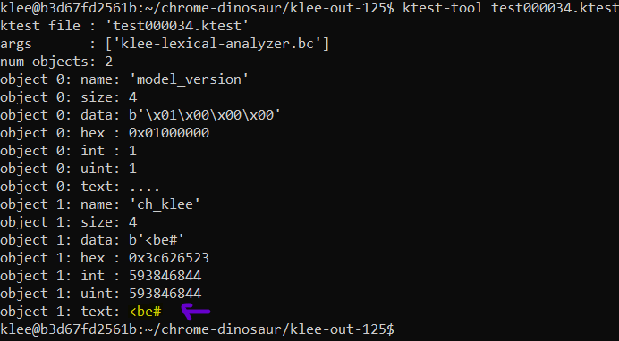
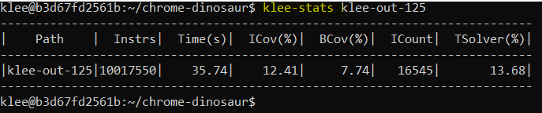
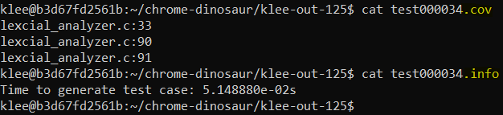
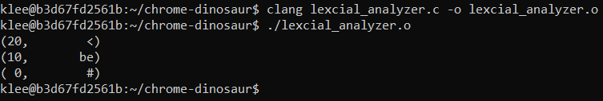

# Lexical Analyzer with Klee

This program implements Klee, an open source constraint solver, to run symbolic execution on a Lexical Analyzer

### Requirements

This program is compiled using clang and requires the user to download and install klee and it's dependancies as well.(KLEE's official Github has further details : https://klee.github.io/
)

### Implementation

Run the .c file with clang to generate the llvm supported bitcode file

`clang -c -g -emit-llvm klee-lexical-analyzer.c` --> this will create a .bc file

And then run the klee command

`klee --libc=uclibc --posix-runtime --external-calls=all --only-output-states-covering-new --optimize --max-tests=50 --max-time=300 --write-cov --write-test-info --write-paths klee-lexical-analyzer.bc`

### Code

In this program, user input a stream of characters seperated by spaces and terminated by '#' symbol and program converts them to a stream of lexical tokens. The group of characters provided by the user is changed to symbolic variable array. For testing purpose, we reduced the array size to 4, and KLEE generates an array of characters follwed by a '#' character and the output generated is a list of combinations of various characters and it's corresponding lexcial tokens.

### Output

The output is a collection of klee files. Additional options were provided in the klee command to generate .info, .path and .cov files to provide more information about the test cases. The klee-out-125 directory is the output of KLEE run on lexical analyzer code.

We encounter 2 major error during KLEE run

1. 'token' variable was deallocated after converting the stream of characters to lexical token. The next iteration of KLEE when tried accessing the array 'token', it caused any exception stating free of global variable. Output file corresponding to error is present in klee-out-124 directory.
2. We changed the array size to 10 and ran KLEE, we encountered memory out of bounds exception thrown by KLEE. Output file corresponding to error is present in klee-out-131 directory.

One of our klee output file. You can see that the data for our input variable is ">be#".

KLEE Statistics\  

KLEE additional files\  

Lexcial Output of KLEE generated data\

