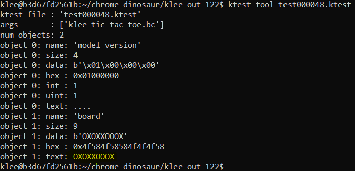
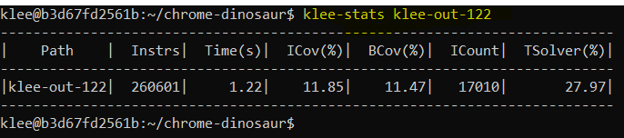
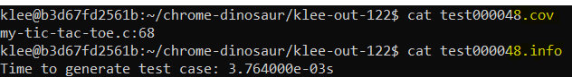
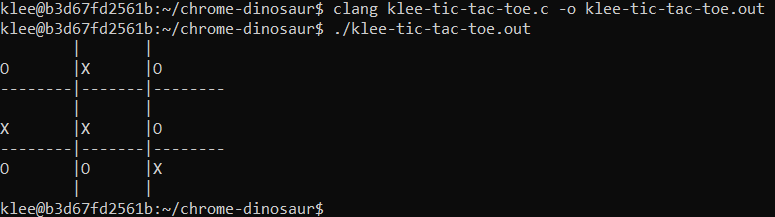

# Tic-Tac-Toe Solver with Klee

This program implements Klee, an open source constraint solver, to solve a tic-tac-toe game.

### Requirements

This program is compiled using clang and requires the user to download and install klee and it's dependancies as well.(KLEE's official Github has further details : https://klee.github.io/
)

### Implementation

Run the .c file with clang to generate the llvm supported bitcode file

`clang -c -g -emit-llvm klee-tic-tac-toe.c` --> this will create a .bc file

And then run the klee command

`klee --libc=uclibc --posix-runtime --external-calls=all --only-output-states-covering-new --optimize --max-tests=50 --max-time=300 --write-cov --write-test-info --write-paths klee-tic-tac-toe.bc`

### Code

In this program user inputs by Player 1 (X's) and Player 2 (O's) (which is where user should enter the square number to place the X's or O's to play the Tic-Tac-Toe game) is changed to a symbolic variable. KLEE will set this `input array` declared as `board` of size 9 in the program as symbolic and run through all possible combinations. There are four possible cases - Player 1 Wins, Player 2 Wins, Draw Game, Invalid Combination. For every combination found by KLEE, the program will validate the combination and print the result in the prompt for every combination. The KLEE command run in prompt will uncover only new paths and exclude any duplicate test cases which have the same paths and using various KLEE options we're finding additional information about the test cases, time taken and coverage information.

### Output

The output is a collection of klee files. Additional options were provided in the klee command to generate .info, .path and .cov files to provide more information about the test cases. The klee-out-122 directory is the output of KLEE run on tic-tac-toe code.

One of our klee output file. You can see that the data for our input variable is OXOXXOOOX.

KLEE Statistics\

KLEE additional files\

Board Display of KLEE generated data (modify displayboard function in code to display your tic-tac-toe board)

